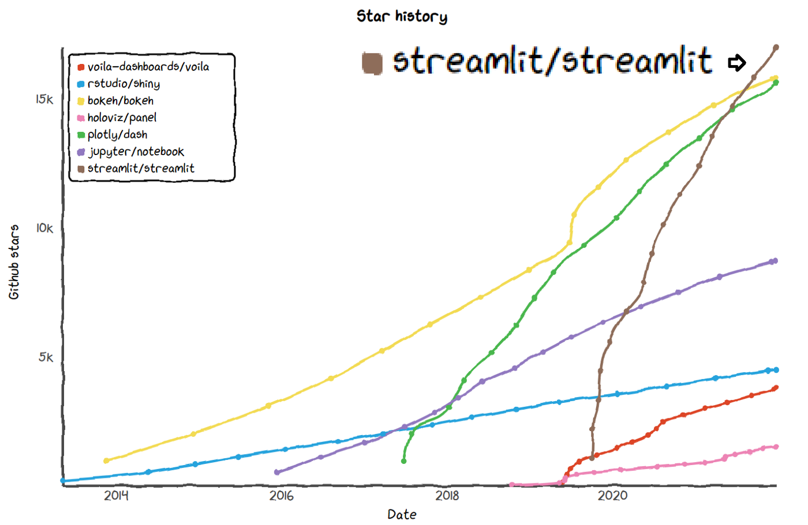
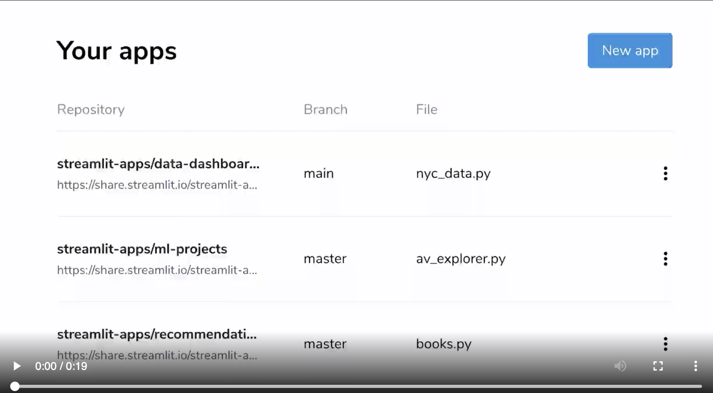

# Parte 1 - Streamlit World
*Nuestro héroe abandona su mundo conocido y debe desarrollar nuevas habilidades* 

## 1. Sobre mí

### ¿Quién soy?

Trabajo en la empresa uPlanner como Chief Data Officer, liderando los equipos de Data Scientists y Data Engineers (¿Interesado? ¡contáctame!). Llevo programando en Python desde el 2008, y siempre estoy buscando nuevas librerías. He dictado charlas y talleres en diversas PyCon (Colombia, Argentina, Chile, Latam) y desarrollado algunas librerías open source (pypsdier y streamlit_book). ¿Más sobre mí? [Github](https://github.com/sebastiandres), [Twitter](https://twitter.com/sebastiandres) & [Linkedin](https://www.linkedin.com/in/sebastiandres/).

{:height="250px"}

### ¿Qué relación tengo con streamlit?

Aprendí sobre streamlit en plena pandemia. Por formación, desarrollo código pero no tengo experiencia (ni tiempo) para convertir código en una GUI/página web. Streamlit solucionó esa gran debilidad. ¡Me permitió generar mucha visibilidad en mis proyectos personales y profesionales, y ayudarme a resolver muchos problemas (y crear algunos otros)!

{:height="350px"}

En Noviembre del 2021 hice una charla sobre streamlit en la PyCon Chile donde presenté directamente desde una app hecha en streamlit, y poco después, comencé a participar más activamente en la comunidad de streamlit. He participado en 2 hackatones de Streamlit, obteniendo premios en ambas, y también publicado en el blog de streamlit. Actualmente formo parte del ["Streamlit Creators Community"](https://streamlit.io/creators/).

### Puro bla bla bla... ¡muéstranos que has hecho!
Algunas de mis apps, por orden cronológico:

* [xkcd plots](https://sebastiandres-streamlit-xkcd-streamlit-app-0f8sh1.streamlitapp.com/): ¡mi primera app en streamlit! Explorando los widgets y cómo graficar una función genérica. 
* [Happy Birds](https://sebastiandres-streamlit-happy-birds-happy-birds-qzi7ap.streamlitapp.com/): Una app que desarrollé para un artículo en el [blog de streamlit](https://blog.streamlit.io/how-to-create-interactive-books-with-streamlit-and-streamlit-book-in-5-steps/), para ilustrar el uso de la librería streamlit_book.
* [El datasaurio](https://datasaurus.streamlitapp.com/): Una app para ilustrar cómo streamlit permite complementar un artículo, y la importancia de graficar los datos. Mi app favorita.
* [Confusion Matrix](https://sebastiandres-ml-edu-confusion-matrix-streamlit-app-3q5126.streamlitapp.com/): Explorando los límites de streamlit en html y javascript, enseñando sobre la matriz de confusión, y jugando con la última pelicula de matrix.
* [Multipage Template](https://stbook-template.streamlitapp.com/): Un template para hacer una app multipágina con autenticación.


## 2. Sobre Streamlit

### ¿Cuándo usar streamlit?
Usa Streamlit si quieres:
* Concentrarte en tu código pero también poder compartirlo con el resto del mundo de manera sencilla.
* No necesitas que la página web sea "ultra-responsiva" y no necesitas tener un control completo del diseño de la página. 
* Si tu webapp no está orientada a smartphones.
* Si quieres crear aplicaciones en minutos y no en horas.

### ¿Qué es streamlit?
* Es una librería para python que permite crear webapps interactivas 100% python y de manera MUY sencilla.
* Con multiples opciones de deployment.
* Con soporte nativo a librerías de visualización como matplotlib, plotly, altair, etc.
* Con una una comunidad extremadamente activa desarrollando mejoras, nuevos componentes, tutoriales y más.

### ¿Porqué usar streamlit?
* Es increíblemente fácil y entretenido. Casi en el límite de lo adictivo. Elementos, variables, archivos, gráficos, etc: todo es Python 🐍
* Simple pero potente: Programar con streamlit es como jugar con legos... está diseñado para encajar perfectamente y que puedas armar todo lo que quieras.
* Batteries included: Incluye una colección de elementos de construcción, extensible mediante componentes, y por supuesto, con todas tus librerías favoritas.
* Ofertas de trabajo: se está volviendo una librería extreamadamente popular. 
* Cada proyecto se vuelve algo concreto y que puedes compartir, mejora la visibilidad de tu trabajo.

### Historia
Streamlit fue fundada en 2018 por Adrien Treuille, Amanda Kelly, y Thiago Teixeira. A pesar de ser una librería de código abierto, su desarrollo está a cargo de la startup del mismo nombre y tiene detrás un equipo de +60 personas. En marzo del 2022, Streamlit fue adquirida por Snowflake. La librería seguirá siendo una librería de código abierto, pero se espera tenga una integración potente con Snowflake. Tiene un desarrollo vertiginoso, con nuevas versiones y funcionalidades saliendo cada semana.

{:height="400px"}

### Filosofía
>> "Streamlit is an open-source Python library that makes it easy to create and share beautiful, custom web apps for machine learning and data science. In just a few minutes you can build and deploy powerful data apps."

Es muchísimo más simple de usar que un web framework como django, flask, bottle u otras. ¡Todo es python! 

No es necesario dominar nada de html, css, javascript, etc. ¡Todo es python!

No hay convenciones ni frameworks, solo apis que regresan objetos o valores de python.

### Más ejemplos

* [SatSchool](https://share.streamlit.io/spiruel/satschool/main/app.py): Una de las mejores webapps educativas que he visto, para aprender sobre datos satelitales de la tierra.
* [GeoSpatial](https://geospatial.streamlitapp.com/): Webapp para procesar datos geospaciales.
* [DeepDream](https://share.streamlit.io/streamlit/demo-deepdream): Una demo de DeepDream, una forma de arte psicodélico generado por redes neuronales.
* [Cheatsheet](https://share.streamlit.io/daniellewisdl/streamlit-cheat-sheet/app.py): Resumen de funcionalidades de streamlit, hecho en streamlit.
* [Galería oficiall de Ejemplos](https://streamlit.io/gallery): Lista oficial de ejemplos de streamlit, clasificadas según tema. 
* [Best of Streamlit (según jrieke)](https://github.com/jrieke/best-of-streamlit): Lista de los mejores ejemplos de streamlit.

## 3. Instalación

### ¿Cómo instalar streamlit?
Es una librería de python: sólo usa pip

```
pip install streamlit
```

o si quieres una versión específica
```
pip install streamlit==1.10.0
```

### ¿Cómo desarrollar en streamlit?
Si quieres desarrollar una webapp y compartirla, conviene generar un ambiente de trabajo para que puedas la ejecución sea reproducible. Crea un archivo `requirements.txt` con las librerías y sus versiones a utilizar.

```
# requirements.txt
streamlit==1.10.0
matplotlib==3.1.3
```

Con virtualenv creas un ambiente de trabajo e instala las librerías desde requirements.txt:
```
virtualenv venv
source venv/bin/activate
pip install -r requirements.txt
```
(para salir del ambiente virtual, usa `deactivate`)

Nota: No olvides incluir la versión de las librerías. Es un trabajo extra, pero garantiza que la ejecución sea reproducible y estable en el tiempo. No hay nada más molesto que pensar que una app está funcionando, para descubrir después que ya no está funcionando porque la última versión de una librería X hizo un cambio que te afectó sin saberlo.

## 4. Actividad práctica

Para las actividades del taller resulta ideal contar con una cuenta gratuita en github. Si no tienes una, puedes crearla en github.com. Si no tienes cuenta y no deseas crear una, puedes ejecutar en local las actividades y unicamente no podrás hacer deployment a la nube.

¡Estamos listos para crear nuestra primera app!


Realiza las siguientes tareas:

- [ ] Realiza un fork del repositorio en [github](https://github.com/sebastiandres/streamlit4dummies).

- [ ] Descarga **tu** repositorio a local: 
```
git clone git@github.com:MYUSER/streamlit4dummies.git
```

- [ ] Genera el ambiente virtual y activalo
```
virtualenv venv
source venv/bin/activate
```

- [ ] Instala las librerías
```
pip install -r requirements.txt
```

- [ ] Levanta la aplicación
```
streamlit run Inicio.py
```

Edita el archivo `Inicio.py` y cómo se refleja casi inmediatamente en la aplicación.

## 5. Elementos de Streamlit
La [documentación de la API](https://docs.streamlit.io/library/api-reference) de streamlit es magnífica. Revísala frecuentamente, porque la librería mejora semana a semana.

### Configuración (setup)
El primer paso (o el último paso, según prefieras) es realizar algunas configuraciones de la aplicación. Estas son opcionales, pero permiten hacer que la aplicación se vea mejor.

La función `set_page_config` ([doc](https://docs.streamlit.io/library/api-reference/utilities/st.set_page_config)) permite configurar el favicon y título de la página en el navegador, y también si el texto debe ocupar todo el ancho posible (`wide`) o centrado (`centered`). Debe ser el primer comando que se ejecuta en la aplicación, después de importar la(s) librería(s).

```python
st.set_page_config(
     page_title="Mi título de app perfecto",
     page_icon="❤️",
     layout="wide",
     initial_sidebar_state="expanded",
     menu_items={
         'Get Help': 'https://www.extremelycoolapp.com/help',
         'Report a bug': "https://www.extremelycoolapp.com/bug",
         'About': "# This is a header. This is an *extremely* cool app!"
     }
 )
```

La funcionalidad de multipágina es muy reciente en Streamlit ([api](https://docs.streamlit.io/library/get-started/multipage-apps)). Su funcionamiento es sencillo: todas las páginas adicionales a mostrar deben existir en una carpeta llamada `pages`. Los archivos se mostrarán de manera alfabética, y el nombre de la página será el nombre del archivo (omitiendo si existe inicialmente un número o un emoji)

```bash
Inicio.py # Archivo principal a ejecutar mediante "streamlit run Inicio.py"
└─── pages/
  └─── 1_Intro.py # Primera página
  └─── 2_Página_dos.py # Segunda página
  └─── 99_😎_Ultima_página.py # Tercera página, y tiene como ícono un emoji 😎
```

### ¿Cómo colocar elementos?
Existen varios formas de ordenar el contenido de una aplicación. Prueba editar el archivo `Inicio.py` y observar los cambios.

**Columnas** ([st.columns](https://docs.streamlit.io/library/api-reference/layout/st.columns)): Permite crear columnas de ancho fijo, agregado elementos a cada uno de ellas.

{:height="250px"}

```python
col1, col2 = st.columns(2) # Anchos iguales
#col1, col2 = st.columns([2, 1]) # Anchos proporcionales
with col1:
    st.write("A cat")
    st.button("A button")
col2.button("Another button")
col2.write("A dog")
```

**Expander** ([st.expander](https://docs.streamlit.io/library/api-reference/layout/st.expander)): Permite crear un elemento acordeón que se despliega o se contrae.

{:height="250px"}

```
with st.expander("Título del expander"):
    # Este contenido se muestra solo cuando se expande el elemento
    st.write("Hola mundo")
```

**Tabs** ([st.tabs](https://docs.streamlit.io/library/api-reference/layout/st.tabs)): Permite crear un menú de pestañas.

{:height="250px"}

```
tab1, tab2 = st.tabs(["Tab 1", "Tab 2"])
with tab1:
    # Este contenido se muestra en la pestaña 1
    st.write("Hola mundo")

with tab2:
    # Este contenido se muestra en la pestaña 2
    st.write("¿Que tal, festival?")
```

**Sidebar** ([st.sidebar](https://docs.streamlit.io/library/api-reference/layout/st.sidebar)): Permite agregar elementos a la barra lateral de la aplicación. Esta barra lateral se muestra sólo si tiene elementos en ella (páginas o elementos agregados).

{:height="250px"}

```
# En lugar de llamar a st directamente
# Llamamos a st.sidebar
st.sidebar.write('Esto está en el sidebar')
if st.sidebar.button('Mi botón opcional'):
    st.balloons()
```

Existe un trucazo interesante. Si necesitas mostrar elementos en un orden distinto al que se van calculando, puedes generar un placeholder utilizando la función `st.empty`.
Con ello, streamlit sabe que tiene que reservar un lugar para un elemento que le será alimentado después (y que puede ser cualquier elemento válido y compatible). También puedes usar `st.empty` para hacer desaparecer un elemento creado de esta forma.

Prueba copiando, pegando y ejecutando este código en el archivo `Inicio.py`
```
import time
if st.button("Click me!"):
    st.write("Uno")
    e2 = st.empty()
    e3 = st.empty()
    e3.write("Tres")
    time.sleep(2)
    e2.write("Dos")
    time.sleep(2)
    e3.empty()
    e2.empty()
```

### ¿Qué elementos colocar?
La cantidad de elementos en Streamlit es abrumadora. No alcanzaremos a mostrarlos todos. Para ver todos los elementos disponibles, visita la [documentación de la API](https://docs.streamlit.io/library/api-reference). A diferencia de Streamlit, prefiero clasificar los elementos en cuatro categorías: 
- Entrada de datos: para pedir datos al usuario.
- Control: para alertar o informar al usuario.
- Output y multimedia: para mostrar algo al usuario.
- Celebración: para indicar al usuario de un evento memorable.

La mejor manera es buscar en la documentación de la API, e ir probando los elementos que se necesitan. En [https://st4dummies.streamlitapp.com/StreamlitElements](https://st4dummies.streamlitapp.com/StreamlitElements) existe una demostración interactiva de casi todos los elementos (que puede compararse con el archivo `pages/StreamlitElements.py`).

## 6. Actividad Práctica: Personaliza la página de Inicio
Utiliza los elementos que más te hayan llamado la atención para personalizar la página principal con alguna actividad.

Algunas ideas:
* Agrega tu nombre y una foto de perfil.
* Obtén el nombre del usuario y una fecha, y calcula cuantos días faltan para su cumpleaños.
* ¡Haz un gráfico interesante!

## 7. Deployment a la nube
Para compartir tu aplicación, necesitas alojarla en la nube para que otras personas puedan accederla y no exista sólo en tu computador. Existen varias alternativas: Streamlit Share, heroku, hugging face, y varias otras. En todos los casos, el prerrequisito es tener el código almacenado en un repositorio en línea (preferentemente github debido a las integraciones disponibles).

El video lo explica bien como hacerlo una vez que tienes una cuenta en https://share.streamlit.io/

[](https://s3-us-west-2.amazonaws.com/assets.streamlit.io/videos/streamlit_sharing_silent.mp4 "Streamlit Share")

## 8. Actividad Práctica: Deploy a la nube

- [ ] Subir cambios a tu repositorio
```
git commit -am "Mis cambios se van a la nube"
git push
```

- [ ] Hacer deployment a Streamlit Share

## 9. Consejos Finales

- Revisar la documentación de la api constantemente. Siempre agregan nuevas funcionalidades.
- Seguir en redes sociales a @streamlit y personas de interés para consejos e ideas.